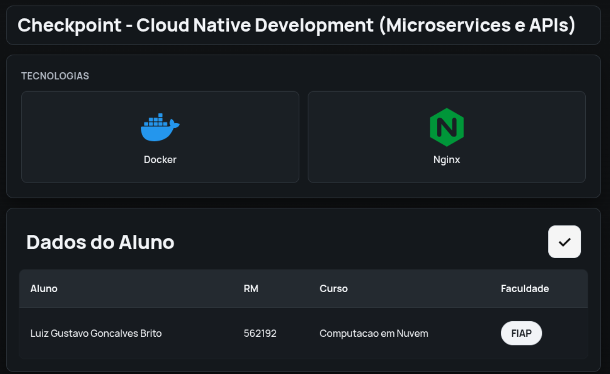

# Laboratório 1: Docker com Nginx

Este projeto demonstra a criação e execução de um container Docker para um servidor web Nginx simples, utilizando um script de automação (`script.sh`) para facilitar o processo de build e run.



## Como Usar

> [!NOTE]
> **Pré-requisitos:**
> - Docker instalado e em execução.
> - Permissão para executar shell script.

### Execução

``` bash
cd 1-lab
chmod +x script.sh
./script.sh
```

O script irá automaticamente:
- Construir a imagem Docker a partir do `Dockerfile`.
- Iniciar um container a partir da imagem criada.
- Exibir o endereço de acesso.

Após a execução, o servidor Nginx estará disponível em [http://localhost:3000](http://localhost:3000).

## Comandos Docker no Script

O `script.sh` automatiza os seguintes comandos:

### Docker Build

| Parâmetro | Descrição | Motivo |
| :--- | :--- | :--- |
| `-t cp01-lab1` | Define a "tag" (nome) da imagem. | Para identificar a imagem facilmente. |
| `.` | Define o contexto do build (o diretório atual). | O Docker usará os arquivos do diretório (`Dockerfile`, etc.) para construir a imagem. |

### Docker Run

| Parâmetro | Descrição | Motivo |
| :--- | :--- | :--- |
| `-d` | **Detached Mode**: executa o container em segundo plano. | Libera o terminal para outros comandos enquanto o container roda. |
| `--name cp01-lab1` | Define um nome para o container. | Facilita o gerenciamento (parar, remover, ver logs) usando um nome fixo. |
| `-p 3000:3000` | Mapeia a porta 3000 do host para a 3000 do container. | Permite acessar o Nginx (que roda na porta 3000 do container) através de `localhost:3000`. |
| `--mount` | Monta um arquivo ou diretório do host no container. | Para refletir alterações no `index.html` local imediatamente, sem precisar reconstruir a imagem. |
| `readonly` | Torna o `mount` somente leitura. | Garante que o container não possa modificar o arquivo `index.html` no host. |

## Dockerfile

O `Dockerfile` utiliza uma imagem base já existente (`luandi09/cp01-lab01:v1.0`) que contém o Nginx.
- `EXPOSE 3000`: Informa que o container expõe a porta 3000.
- `HEALTHCHECK`: Define um comando para verificar a saúde do container. A cada 30 segundos, ele tenta acessar a página inicial do Nginx. Se falhar 3 vezes seguidas, o container é marcado como "unhealthy".

## Análise de Vulnerabilidades com Trivy

É possível escanear a imagem gerada (`cp01-lab1`) com a ferramenta [Trivy](https://github.com/aquasecurity/trivy) para verificar a existência de vulnerabilidades.

**Comando para escanear:**
```bash
trivy image cp01-lab1
```

> [!TIP]
> A imagem base `luandi09/cp01-lab01:v1.0` foi construída de forma a não possuir vulnerabilidades conhecidas, resultando em **0 vulnerabilidades** no scan.
